<div align="center">

<picture>
  <source media="(prefers-color-scheme: dark)" srcset="assets/header-dark.svg">
  
</picture>

**I build polished mobile, full-stack, and AI-powered products from idea to release.**

[Portfolio](https://www.salmamahjoub.me) &nbsp;·&nbsp; [LinkedIn](https://www.linkedin.com/in/salma-mahjoub-706b87246/) &nbsp;·&nbsp; [Email](mailto:mahjoub2003@gmail.com) &nbsp;·&nbsp; [CV](https://www.salmamahjoub.me/salma-mahjoub-cv.pdf)

</div>

<br>

```kotlin
val salma = Developer(
    focus        = listOf("Mobile", "Full-stack", "AI-powered products"),
    mobile       = listOf("SwiftUI", "Jetpack Compose", "Flutter"),
    backend      = listOf("NestJS", "Next.js", "Symfony"),
    strengths    = listOf("product thinking", "clean architecture", "shipping"),
    experience   = listOf("SAP ABAP @ SIRYOS", "Data analysis @ Ipsos MENA", "Mobile & API @ Eklectic"),
    availableFor = "PFE - January to June 2027"
)
```

<br>

## Availability

| | |
|---|---|
| **Seeking** | A final-year project (PFE) in mobile development, full-stack engineering, or AI |
| **Period** | January to June 2027 (6 months) |
| **Work mode** | On-site, hybrid, or remote |
| **Contact** | [mahjoub2003@gmail.com](mailto:mahjoub2003@gmail.com) |

<br>

## Stack, by how I use it

| | |
|---|---|
| **Mobile** |  |
| **Backend & web** |  |
| **Data & AI** |  &nbsp; Machine Learning, NLP, Computer Vision |
| **Tools** |  |

<details>
<summary><b>Also comfortable with</b></summary>

<br>

Java, C, C++, C#, PHP, Go, ABAP, React Native, JavaFX, Qt, UML, REST APIs, SQL.

</details>
